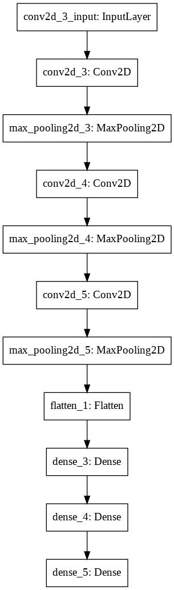
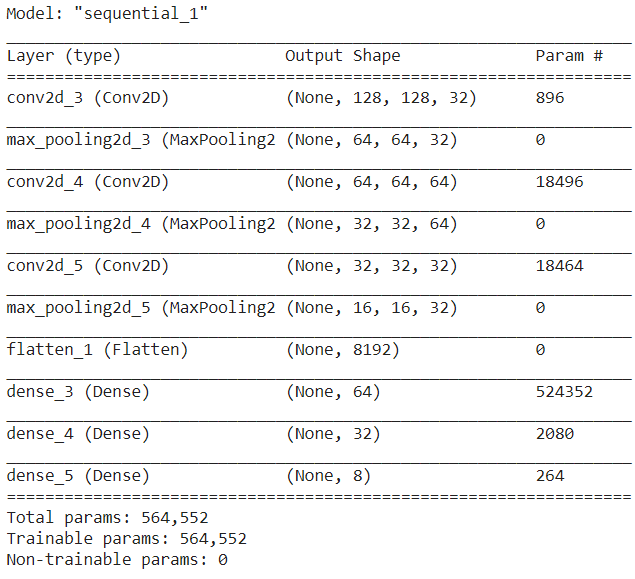
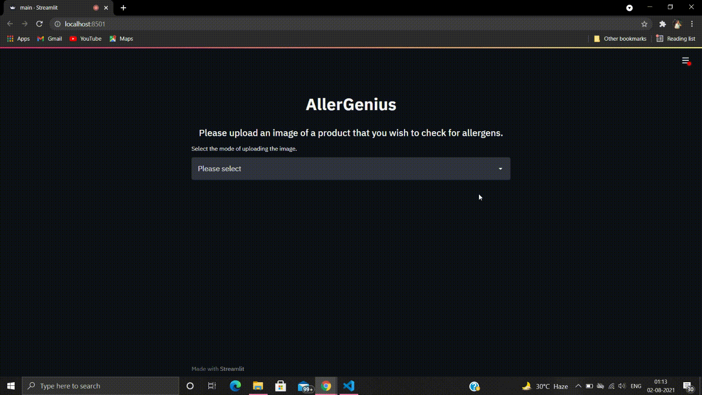
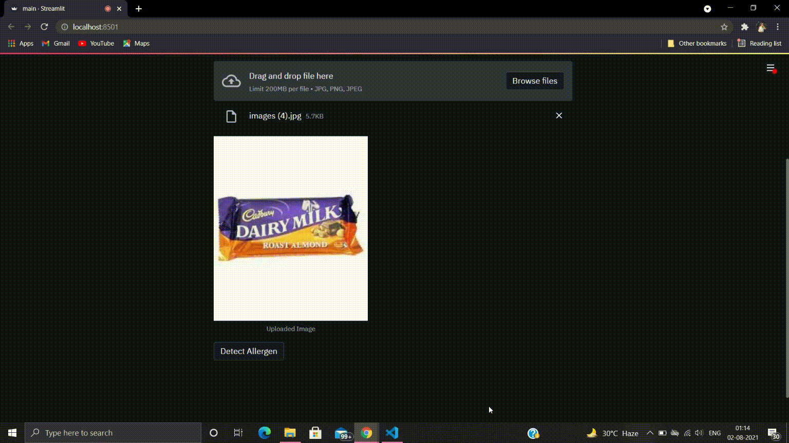

# AllerGenius
## Problem statement 
There are a lot of people who suffer from certain allergies and struggle to find eatables that don't contain those allergens. I have also faced that problem a billion times because i have a severe tree nut allergy and sometimes when i purchase packaged foods the allergen information aren't mentioned or even if they are, it is in such a fine print that it is really easy to miss. This has caused a lot of problems and turmoil in my life and in the lives of a lot of other people too.

## Proposed solution 
For dealing with this problem, it is necessary that people become aware as soon as possible about the brands and the goods that they are purchasing or eating; is safe for them or not. The software for allergen detection is a CV based application deployed as a web app with the help of *Streamlit*. The user can upload an image of the product that they will like to test and then the app will notify them about the presence of allergens along with its name.

## Dataset
For this project, I have collected the data by *web scraping* which presently contains 770 images belonging to 8 classes viz *'PEANUTS', 'TREE NUTS', 'MILK', 'NO ALLERGENS', 'FISH', 'EGG', 'SOY', 'WHEAT'*. The data has been split into 607 training+validation and 163 test images.  
One can  send a request for accessing the dataset <a href= "https://drive.google.com/drive/folders/1tDJpAPi3p5VSeuhVHSeMoAENMuUEsJ1Y?usp=sharing">here</a>.

### Visualizing a part of the dataset.

## Model components
The model has 3 conv2D Layers each followed by a MaxPooling2D. The Flatten layer follows before the forward pass and classification task performed by the Fully Connected Layers with ReLU and Softmax activation function respectively.    
 

## Usage guidelines
- Cloning the repository

        git clone https://github.com/Sanchita0812/AllerGenius

- Entering the directory

        cd AllerGenius
        
- Setting up the Python Environment with dependencies

        pip install -r requirements.txt
        
- Running the Web Application from terminal 

        streamlit run main.py 
 
 Check out the notebook <a href= "https://nbviewer.jupyter.org/github/Sanchita0812/AllerGenius/blob/main/Notebook/Allergen%20notebook.ipynb" target= "_blank">here</a>.
        
## Demonstration 
- Uploading image from device 

- Uploading image via link

- Detecting the Allergen

This project has been developed by <a href= "https://github.com/Sanchita0812">Sanchita Kiran</a>
